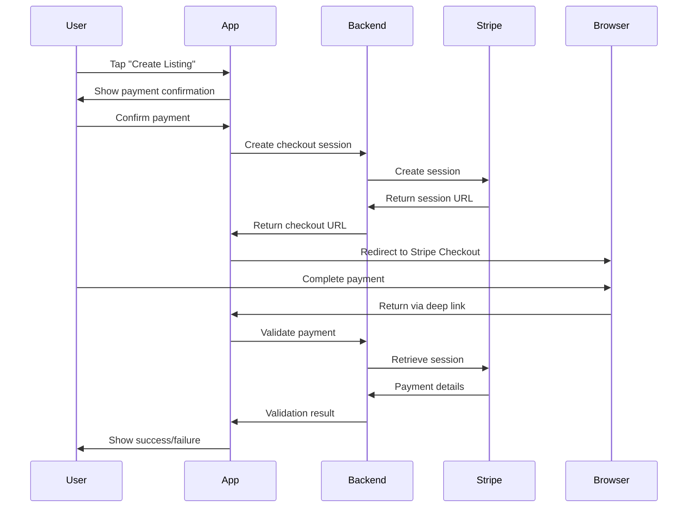

# Stripe Browser Payment Implementation

## Overview

This implementation uses **Stripe Checkout** with browser redirects to avoid Apple's 30% in-app purchase commission while maintaining the security and reliability of Stripe's payment processing.

## How It Works

1. **User initiates payment** in the OffCampus Housing app
2. **App creates Stripe Checkout Session** via your backend API
3. **User is redirected to browser** for Stripe Checkout
4. **Payment is processed** securely by Stripe
5. **User returns to app** via deep link with payment result
6. **App validates payment** and completes the listing creation

## Key Benefits

✅ **Avoid 30% App Store fees** - Payments processed outside the app  
✅ **Keep using Stripe** - Same trusted payment processor  
✅ **Better conversion rates** - Familiar Stripe Checkout experience  
✅ **Full payment methods** - Credit cards, digital wallets, bank transfers  
✅ **Regulatory compliance** - Meets App Store guidelines for physical services  

## Implementation Details

### 1. Payment Flow



### 2. Code Structure

#### Frontend (React Native)
- `HybridPaymentService.ts` - Main payment service
- `CreateListingScreen.tsx` - Initiates payment flow
- `App.tsx` - Handles deep link returns

#### Backend (Node.js/Express)
- `backend-stripe-example.js` - Complete backend implementation
- Endpoints for creating and validating payments
- Webhook handling for real-time updates

## Setup Instructions

### 1. Backend Setup

1. **Deploy the backend** using `backend-stripe-example.js`:
   ```bash
   npm install express stripe cors
   node backend-stripe-example.js
   ```

2. **Set environment variables**:
   ```bash
   STRIPE_SECRET_KEY=sk_live_your_actual_secret_key
   STRIPE_WEBHOOK_SECRET=whsec_your_webhook_secret
   PORT=3000
   ```

3. **Deploy to production** (Heroku, AWS, etc.)

### 2. Frontend Configuration

1. **Update API URL** in `HybridPaymentService.ts`:
   ```typescript
   private static readonly API_BASE_URL = 'https://your-domain.com/api';
   ```

2. **Configure deep links** in `app.json`:
   ```json
   {
     "expo": {
       "scheme": "offcampus"
     }
   }
   ```

### 3. Stripe Configuration

1. **Get your API keys** from [Stripe Dashboard](https://dashboard.stripe.com/apikeys)

2. **Set up webhooks**:
   - URL: `https://your-domain.com/api/payments/webhook`
   - Events: `checkout.session.completed`, `payment_intent.payment_failed`

3. **Test with Stripe CLI**:
   ```bash
   stripe listen --forward-to localhost:3000/api/payments/webhook
   ```

## Testing

### 1. Development Testing

```bash
# Start the backend
node backend-stripe-example.js

# Start the React Native app
npx expo start

# Test payment flow
# 1. Navigate to Create Listing
# 2. Fill out form and tap Submit
# 3. Confirm Stripe payment dialog
# 4. Complete payment in browser
# 5. Verify return to app
```

### 2. Test Cards

Use Stripe's test cards for development:
- **Success**: `4242424242424242`
- **Decline**: `4000000000000002`
- **3D Secure**: `4000002500003155`

### 3. Deep Link Testing

Test deep link handling:
```bash
# Simulate successful payment return
adb shell am start \
  -W -a android.intent.action.VIEW \
  -d "offcampus://payment/success?session_id=cs_test_123&listing_id=new" \
  com.offcampushousing.app
```

## Production Checklist

### Backend
- [ ] Deploy backend to production
- [ ] Set live Stripe API keys
- [ ] Configure webhook endpoints
- [ ] Set up SSL certificates
- [ ] Configure CORS for your domain
- [ ] Set up monitoring and logging

### Frontend
- [ ] Update API URLs to production
- [ ] Test deep link handling
- [ ] Verify payment flow end-to-end
- [ ] Test on both iOS and Android
- [ ] Submit app update to stores

### Stripe Configuration
- [ ] Switch to live API keys
- [ ] Configure live webhook endpoints
- [ ] Set up payment method restrictions
- [ ] Configure tax handling (if needed)
- [ ] Set up dispute handling

## Legal Compliance

### App Store Guidelines

✅ **Physical Goods/Services**: Listings are physical services (housing)  
✅ **External Payment Processor**: Stripe processes payments outside the app  
✅ **No Digital Content**: No in-app digital purchases  
✅ **Reader Apps**: Similar to marketplace apps (Airbnb, Uber)  

### Recommended App Store Description

> "OffCampus Housing connects students with landlords for off-campus housing. Listing fees are processed securely through our website using industry-standard payment processing to ensure the best rates and security for our users."

## Security Considerations

### 1. API Security
- Use HTTPS for all endpoints
- Validate all input parameters
- Implement rate limiting
- Use proper authentication

### 2. Deep Link Security
- Validate all incoming URLs
- Never trust URL parameters without verification
- Always validate payments server-side

### 3. PCI Compliance
- Never handle card data directly
- Use Stripe's secure checkout
- Implement proper webhook validation

## Troubleshooting

### Common Issues

1. **Deep links not working**
   - Check app.json scheme configuration
   - Verify intent filters (Android)
   - Test with `adb shell` or iOS Simulator

2. **Payment validation failing**
   - Check backend API connectivity
   - Verify Stripe API keys
   - Review webhook configuration

3. **Browser not opening**
   - Check device permissions
   - Verify URL format
   - Test with different browsers

### Debug Mode

Enable debugging in `HybridPaymentService.ts`:
```typescript
// Add to the top of the class
private static DEBUG = __DEV__;

private static log(message: string, data?: any) {
  if (this.DEBUG) {
    console.log(`[StripePayment] ${message}`, data);
  }
}
```

## Cost Analysis

### Before (Native Stripe)
- **App Store fee**: 30% on all payments
- **Stripe fee**: 2.9% + $0.30
- **Total cost on $25**: $7.50 + $1.03 = **$8.53** (34% total fee)

### After (Browser Stripe)
- **App Store fee**: $0 (external payment)
- **Stripe fee**: 2.9% + $0.30
- **Total cost on $25**: $0 + $1.03 = **$1.03** (4% total fee)

### **Savings: $7.50 per transaction (30% reduction)**

## Monitoring and Analytics

### Key Metrics to Track
- Payment conversion rate
- Payment completion time
- Deep link success rate
- User drop-off points
- Error rates

### Recommended Tools
- Stripe Dashboard for payment analytics
- Sentry for error tracking
- Mixpanel/Amplitude for user analytics
- Your own backend logging

## Support

### Resources
- [Stripe Checkout Documentation](https://stripe.com/docs/payments/checkout)
- [Expo Linking Documentation](https://docs.expo.dev/guides/linking/)
- [React Navigation Deep Linking](https://reactnavigation.org/docs/deep-linking/)

### Common Questions

**Q: Is this compliant with App Store guidelines?**  
A: Yes, this is similar to how apps like Uber, Airbnb, and Amazon handle payments for physical services.

**Q: What if users don't return to the app after payment?**  
A: Stripe webhooks ensure payment processing continues even if users don't return. You can also send push notifications.

**Q: Can I still use native payments as a fallback?**  
A: Yes, you can keep the existing PaymentScreen.tsx as a backup option.

**Q: How do I handle refunds?**  
A: Use Stripe's Dashboard or API to process refunds. Webhooks will notify your app of refund events.
